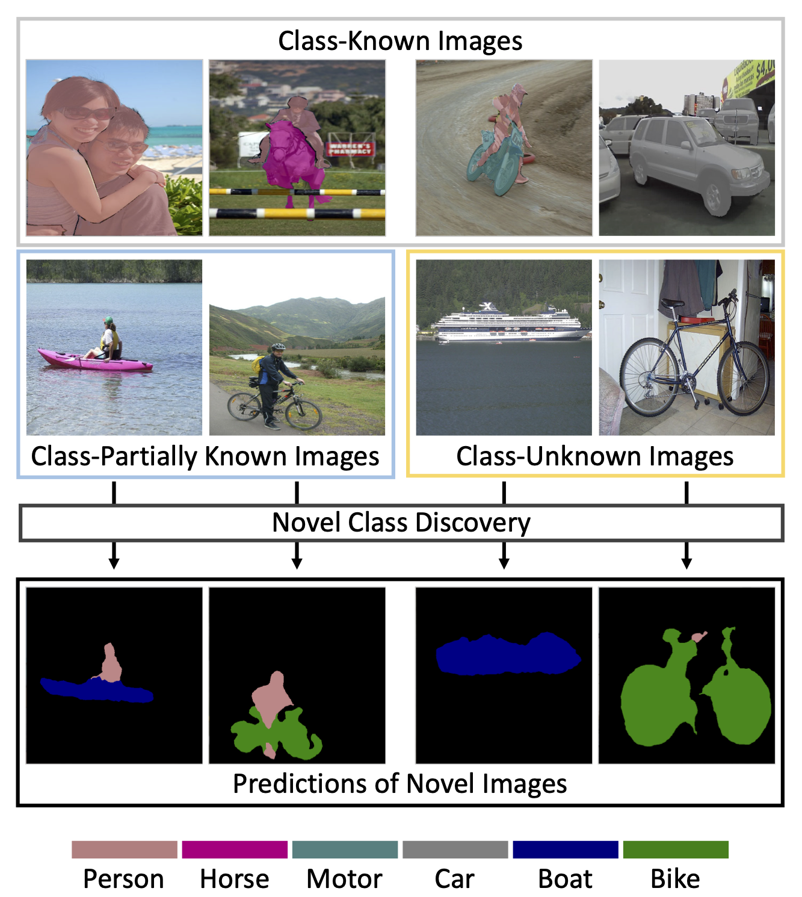

# Novel Class Discovery in Semantic Segmentation

[](https://opensource.org/licenses/Apache-2.0)


This repository contains the official implementation of our paper:

> **[Novel Class Discovery in Semantic Segmentation, CVPR 2022](https://ncdss.github.io)**
> 
> [Yuyang Zhao](http://yuyangzhao.com), [Zhun Zhong](http://zhunzhong.site), [Nicu Sebe](https://disi.unitn.it/~sebe/), [Gim Hee Lee](https://www.comp.nus.edu.sg/~leegh/)

> Paper: [ArXiv](https://arxiv.org/abs/2112.01900)<br>
> Project Page: [Website](https://ncdss.github.io)

> **Abstract:** We introduce a new setting of Novel Class Discovery in Semantic Segmentation (NCDSS), which aims at segmenting unlabeled images containing new classes given prior knowledge from a labeled set of disjoint classes. In contrast to existing approaches that look at novel class discovery in image classification, we focus on the more challenging semantic segmentation. In NCDSS, we need to distinguish the objects and background, and to handle the existence of multiple classes within an image, which increases the difficulty in using the unlabeled data. To tackle this new setting, we leverage the labeled base data and a saliency model to coarsely cluster novel classes for model training in our basic framework. Additionally, we propose the Entropy-based Uncertainty Modeling and Self-training (EUMS) framework to overcome noisy pseudo-labels, further improving the model performance on the novel classes. Our EUMS utilizes an entropy ranking technique and a dynamic reassignment to distill clean labels, thereby making full use of the noisy data via self-supervised learning. We build the NCDSS benchmark on the PASCAL-5^i dataset and COCO-20^i dataset. Extensive experiments demonstrate the feasibility of the basic framework (achieving an average mIoU of 49.81% on PASCAL-5^i) and the effectiveness of EUMS framework (outperforming the basic framework by 9.28% mIoU on PASCAL-5^i).
<br>
<p align="center">
     <br />
    <em>
    Illustration of Novel Class Discovery in Semantic Segmentation (NCDSS).
    </em>
</p>
<br>

## Requirements

* Python = 3.7
* Pytorch = 1.8.0
* CUDA = 11.1
* Install other packages in `requirements.txt`


## Data preparation

**We follow [MaskContrast](https://github.com/wvangansbeke/Unsupervised-Semantic-Segmentation) to prepare the data**

Download [PASCAL VOC 2012](https://drive.google.com/file/d/1pxhY5vsLwXuz6UHZVUKhtb7EJdCg2kuH/view). Unzip the dataset and ensure the file structure is as follows:

```shell
VOCSegmentation
├── images
├── SegmentationClassAug
├── saliency_supervised_model
└── sets
```


### Inference

You can download the pre-trained models in this paper from [Google Drive](https://drive.google.com/drive/folders/1-UdLGD-lmRIHSBhfsHAPFS1ugjkts713?usp=sharing). Then run the command.

```shell
sh scripts/eval.sh
```


### Training
* **Base Training**. 
    ```shell
    sh scripts/base_train.sh
    ```


* **Clustering Pseudo-labeling**. 
    ```shell
    sh scripts/clustering_cmd.sh
    ```


* **Novel Fine-tuning**. 
  
  The pseudo-labels generated in the *Clustering Pseudo-labeling* stage is used for *Novel Fine-tuning* stage. To ensure the reproducibility, you can directly download our generated clustering pseudo-labels from [Google Dive](https://drive.google.com/drive/folders/1Mmv9P1K1r1-zunRaPn1i7GMWRW5lNAMZ?usp=sharing).

  * Basic framework.
    ```shell
    sh scripts/finetune_basic.sh
    ```

  * Entropy ranking.
    ```shell
    sh scripts/entropy_ranking.sh
    ```
    The clean and unclean splits are also provided in [Google Dive](https://drive.google.com/drive/folders/1Mmv9P1K1r1-zunRaPn1i7GMWRW5lNAMZ?usp=sharing).

  * EUMS framework.
    ```shell
    sh scripts/finetune_eums.sh
    ```

## Acknowledgement

Our code is designed based on [MaskContrast](https://github.com/wvangansbeke/Unsupervised-Semantic-Segmentation). If you use this code, please also acknowledge their paper.


## Citation
We hope you find our work useful. If you would like to acknowledge it in your project, please use the following citation:
```
@inproceedings{zhao2022ncdss,
title={Novel Class Discovery in Semantic Segmentation},
author={Zhao, Yuyang and Zhong, Zhun and Sebe, Nicu and Lee, Gim Hee},
booktitle={Proceedings of IEEE Conference on Computer Vision and Pattern Recognition (CVPR)},
year={2022}}
```

## Contact me

If you have any questions about this code, please do not hesitate to contact me.

[Yuyang Zhao](http://yuyangzhao.com)